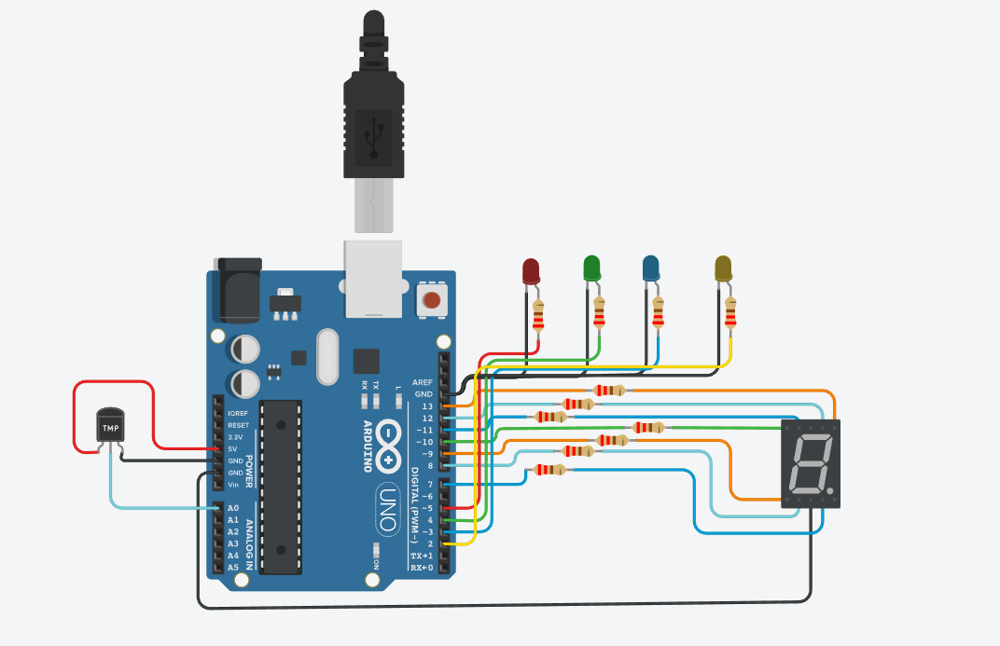

# Ejemplo Documentación Dojos

## Integrantes 
- Ahuitz Caracciolo
- Noelia Garcete Romero
- Hugo Gimenez
- Martin Virun
- Fernando Serrano
- Gonzalo Ortiz Videla
- Enrico Montes
- Enzo Amichetti

## Proyecto: Contador binario.

## Descripción
Indica la temperatura por el display de 7 segmentos y mediante 3 leds indica la temperatura minima, media y maxima.
A traves del monitor en serie nos muestra la temperatua real del sensor.
Mediante el led amarillo indica una alarma por temperatura baja (-12 grados C) y por temperatura alta (16 grados C)

## Función principal
Esta funcion se encarga de encender y apagar los leds en base a la temperatura que se varia en el sensor.

LED _ROJO, LED_VERDE, LED_AZUL, LED_AMARILLO son #define asociados a los pines 5, 4, 3 y 2 respectivamente de la placa Arduino.

(Breve explicación de la función)

~~~ c (lenguaje en el que esta escrito)
void loop()
{
  lecturaTemperatura = analogRead(A0); 
  temperaturaRealC = map(lecturaTemperatura, 20, 358, -40, 125);
  Serial.print("La temperatura es de: ");
  Serial.print(temperaturaRealC);
  Serial.println(" grados.");
  
  if(temperaturaRealC>24)
  {
    printDigit('c');
  } 
  else if(temperaturaRealC<0)
  {
    printDigit('f');
  }
  else
  {
    printDigit('d');
  }
  

  currentTime = millis();
  if((currentTime-previousTime)>200){
    previousTime=currentTime;
    ledState=!ledState;
    
    if(temperaturaRealC>16 || temperaturaRealC<-12)
    {
      digitalWrite(LED_AMARILLO,ledState);
    } 
    else
    {
      digitalWrite(LED_AMARILLO,LOW);
    }
  } 
}

void printDigit(char valor)
{
  digitalWrite(A, LOW);
  digitalWrite(B, LOW);
  digitalWrite(C, LOW);
  digitalWrite(D, LOW);
  digitalWrite(E, LOW);
  digitalWrite(F, LOW);
  digitalWrite(G, LOW);
  
  switch (valor)
  {
  	case 'c':
  	{
        digitalWrite(A, HIGH);
 	      digitalWrite(D, HIGH);
        digitalWrite(E, HIGH);
        digitalWrite(F, HIGH);
      	digitalWrite(LED_ROJO,HIGH);
        digitalWrite(LED_VERDE, LOW);
 		  digitalWrite(LED_AZUL, LOW);
      	break;
  	}
    case 'f':
  	{
        digitalWrite(A, HIGH);
        digitalWrite(E, HIGH);
        digitalWrite(F, HIGH);
        digitalWrite(G, HIGH);
      	digitalWrite(LED_AZUL,HIGH);
      	digitalWrite(LED_ROJO, LOW);
  	    digitalWrite(LED_VERDE, LOW);
      	break;
  	}
  
    case 'd':
      	digitalWrite(G, HIGH);
    	  digitalWrite(LED_VERDE,HIGH);
      	digitalWrite(LED_ROJO, LOW);
  		  digitalWrite(LED_AZUL, LOW);
      	break;
  }

}

~~~

## :robot: Link al proyecto
- [proyecto](https://www.tinkercad.com/things/dLEGPdxlwdK)
## :tv: Link al video del proceso
- [video](https://drive.google.com/file/d/1UHfw_FfSg1y4z331pKAWQrGME3-WARfb/view?usp=sharing)

---
### Fuentes
- [Consejos para documentar](https://www.sohamkamani.com/how-to-write-good-documentation/#architecture-documentation).

- [Lenguaje Markdown](https://markdown.es/sintaxis-markdown/#linkauto).

- [Markdown Cheatsheet](https://github.com/adam-p/markdown-here/wiki/Markdown-Cheatsheet).

- [Tutorial](https://www.youtube.com/watch?v=oxaH9CFpeEE).

- [Emojis](https://gist.github.com/rxaviers/7360908).

---

